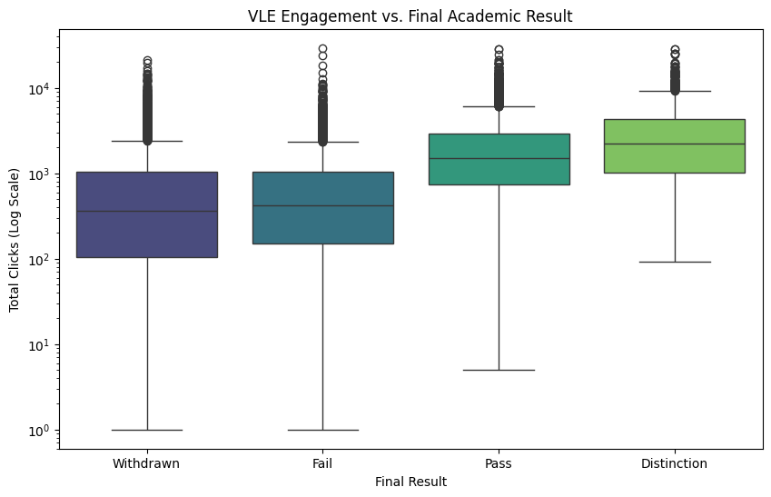

# Predictive Analytics for Student Success  
Using Virtual Learning Environment (VLE) Data

This project shows how simple digital behavior markers in a Virtual Learning Environment can be turned into an early-warning system for student success.  
The analysis is based on 32,044 student–module records with detailed clickstream, registration, and outcome data.

## Key questions

1. How is VLE engagement related to final academic results?  
2. Is consistency (Days Active) more predictive than raw intensity (Total Clicks)?  
3. Can we define a clear tipping point where non-engagement becomes dangerous?  
4. Are there equity gaps in digital effort by socioeconomic status (IMD)?

## Engagement and academic results

The figure below shows how total VLE clicks increase as final results improve.

Students who achieve a Distinction interact with the VLE almost four times as much as students who fail or withdraw.

**Table: Mean engagement by final result**

| Final Result | Mean Clicks | Median Clicks | Std. Deviation |
|--------------|------------:|--------------:|----------------:|
| Distinction  | 3,106.43    | 2,218.0       | 2,978.98        |
| Pass         | 2,171.11    | 1,503.0       | 2,137.91        |
| Fail         |   840.17    |   418.5       | 1,260.85        |
| Withdrawn    |   888.38    |   364.0       | 1,468.34        |

This pattern creates a clear “ladder of success” from Withdrawn to Distinction.

## Consistency vs intensity

The next visual summarizes the correlation structure.

Days Active has a stronger relationship with the Result Score (r = 0.55) than Total Clicks (r = 0.35).  
Showing up on more days matters more than doing a large number of clicks in a few bursts.

When both variables are entered into a model, the standardized coefficients look like this:

Days Active has a strong positive coefficient.  
Total Clicks becomes slightly negative once consistency is accounted for, capturing the “cramming penalty.”

## The survival tipping point

A logistic regression model was used to classify students into “Success” vs “At-Risk”.  
The model reaches about 74% accuracy and 77% recall for the at-risk group.

A simple decision-tree view finds a tipping point at about 32.5 active days.  
The probability curve below shows how passing probability climbs with consistency.

Students who have not reached 33 active days by the mid-point of a module are in a high-risk zone.

## Digital effort gap by socioeconomic status (IMD)

Engagement was also examined by Index of Multiple Deprivation (IMD) bands.

Students in the least deprived areas average about 2,465 clicks.  
Students in the most deprived areas average about 2,192 clicks, a 12.5% effort gap that points to possible digital friction for lower-income students.

## Leadership implications

From a vice-provost or student-success lens, this project supports three practical moves:

- Use Days Active and the ~33-day threshold as hard early-warning metrics.  
- Design nudges, dashboards, and advisor workflows around consistency rather than raw click volume.  
- Target digital equity interventions to close the IMD effort gap.

## Repository and data

All data, code skeletons, and reports are available in this GitHub repository.

- Raw data: `data/raw/`  
- Figures and executive summary: `reports/`

## Contact & links

<a class="port-btn" href="https://www.linkedin.com/in/derrick-dzormeku-mba-75288644" target="_blank" rel="noopener">LinkedIn</a>
<a class="port-btn"
   href="https://mail.google.com/mail/?view=cm&fs=1&to=d.double76@icloud.com&su=Portfolio%20inquiry%20%E2%80%93%20Derrick%20Dzormeku&body=Hi%20Derrick,%0D%0A%0D%0AI%27m%20reaching%20out%20about%20your%20analytics%20portfolio.%20Could%20we%20schedule%20a%20brief%20call%3F"
   target="_blank" rel="noopener">
  Email via Gmail</a>
<a class="port-btn" href="{{ site.github.repository_url }}">GitHub Repo</a>

This project is designed as a portfolio example of how predictive analytics, institutional research, and student-success strategy can be integrated.
